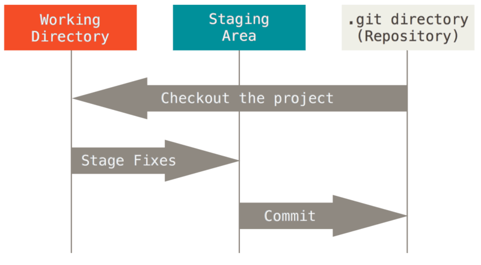

# Задания

- [Первое задание](exercises/exercise_1.md)

# Информация для занятий

## [Git документация](https://git-scm.com/docs)

## Команды

### Задание конфига

    - git config --local user.name "My Name"
    - git config --local user.email myEmail@example.com

### Проверка конфига

    - git config user.name
    - git config user.email

### Клонирование репозитория (скачивание его к себе)

    - git clone

### Проверка состояния файлов (что пометили готовым к коммиту, а что нет)

    - status

    В коммит попадает, то что в состоянии Staging, чтобы добавить в Stagin, воспользуйтесь `add`



### Ветки

    - branch

    - Переключение на ветку

```sh
git checkout <имя_ветки>
```

    - Создание ветки

```sh
git checkout -b <имя_ветки>
```

### Создание коммита

- Добавление в Staging Area

```sh
git add <Имя_файла>
```

- Создание коммита

```sh
git commit -m "<Сообщение_коммита>"
```

- log
- diff
- show
- init
